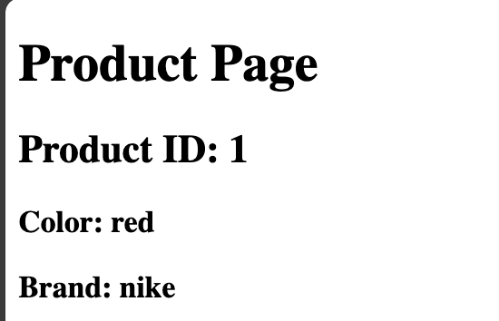

# Nuxt 3 CMS Stock Course EP.8 - Query String

## Outcome

-   Learn how to use query string in Nuxt 3

## Documentation for Router

-   [Nuxt 3 Router](https://v3.nuxtjs.org/docs/concepts/router)

## Setup

1. Add `const route = useRoute()` in `script` tag

2. Add `route.query` in `template` tag

## Example

```vue
<template>
    <div>
        <h1>Product Page</h1>
        <h2>Product ID: {{ route.params.id }}</h2>
        <h3>Color: {{ route.query.color }}</h3>
        <h3>Brand: {{ route.query.brand }}</h3>
    </div>
</template>

<script setup lang="ts">
const route = useRoute();
</script>

<style scoped></style>
```

3. Go to `http://localhost:3000/demo/product/1?color=red&brand=nike`

## Result


