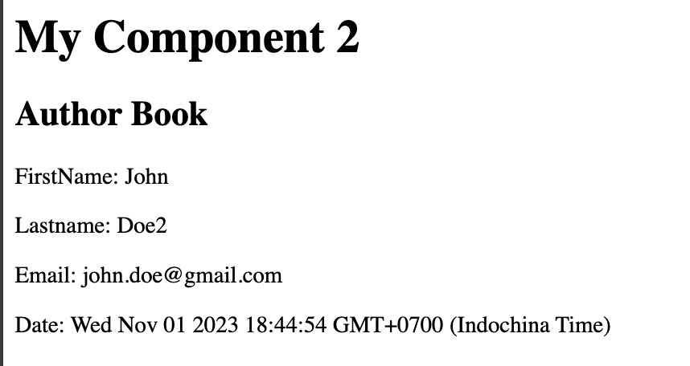

# Nuxt 3 CMS Stock Course EP.13 - Import and Export Type

## Outcome

-   Understand name convention for `type` and `interface` in export
-   Learn how to import and export `type` and `interface`
-   Learn how to use `reactive` with Generic in component

## Documentation for this episode

https://blog.logrocket.com/types-vs-interfaces-typescript/

## Setup

1. Create `types` folder in `~/` directory

2. Create `author.type.ts` in `~/types` directory

```ts
/* types/author.type.ts */
export type TAuthor = {
    firstName: string;
    lastName: string;
    email: string;
    date: Date;
};
```

3. Create `MyComponentTwo.vue` in `~/components/demo` directory

```vue
<template>
    <div>
        <h1>Author Book</h1>
        <p>FirstName: {{ author.firstName }}</p>
        <p>Lastname: {{ author.lastName }}</p>
        <p>Email: {{ author.email }}</p>
    </div>
</template>

<script setup lang="ts">
import { type TAuthor } from "@/types/author.type";

const props = defineProps({
    author: {
        type: Object as PropType<TAuthor>,
        required: true,
        default: "This is my First line of Component",
    },
});
</script>

<style scoped></style>
```

4. Add following in `components.vue`

```vue
/* pages/component.vue */

<template>
    <div>
        <DemoMyComponentOne
            first-line="This is my 1st"
            second-line="This is my 2nd"
            :balance="100"
        ></DemoMyComponentOne>
        <hr />
        <h1>My Component 2</h1>
        <DemoMyComponentTwo :author="author"></DemoMyComponentTwo>
    </div>
</template>

<script setup lang="ts">
import type { TAuthor } from "~/types/author.type";

const author = reactive<TAuthor>({
    firstName: "John",
    lastName: "Doe",
    email: "test@gmail.com",
    date: new Date(),
});
</script>

<style scoped></style>
```

4. Go to `http://localhost:3000/demo/component`

## Result

This is the result of display with component in `component.vue`


