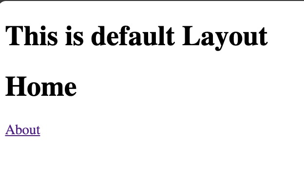
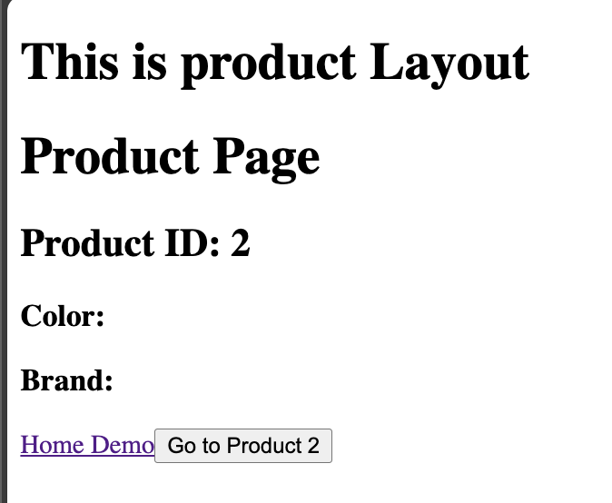

# Nuxt 3 CMS Stock Course EP.14 - Layouts

## Outcome

-   Learn how to use `layouts` in Nuxt 3
-   Learn how to use `layouts` in Nuxt 3 with `components`
-   Learn how to use `layouts` in Nuxt 3 with `props`

## Documentation for this episode

https://nuxt.com/docs/guide/directory-structure/layouts

## Setup

1. Create `layouts` folder in `~/` directory

2. Create `default.vue` and `product.vue` in `~/layouts` directory

```vue
/* layouts/default.vue */

<template>
    <div>
        <h1>This is default Layout</h1>
        <slot></slot>
    </div>
</template>

<script setup lang="ts"></script>

<style scoped></style>
```

```vue
/* layouts/demo/product.vue */

<template>
    <div>
        <h1>This is product Layout</h1>
        <slot></slot>
    </div>
</template>

<script setup lang="ts"></script>

<style scoped></style>
```

3. For `default` layout, change nothing but for `product` layout, add following in `pages/demo/product/[id].vue`

```vue
<template>
    <div>
        <h1>Product Page</h1>
        <h2>Product ID: {{ route.params.id }}</h2>
        <h3>Color: {{ route.query.color }}</h3>
        <h3>Brand: {{ route.query.brand }}</h3>
        <NuxtLink active-class="active" to="/demo/product/1?color=black&brand=B"
            >Home Demo</NuxtLink
        >
        <button @click="goTo('2')">Go to Product 2</button>
    </div>
</template>

<script setup lang="ts">
definePageMeta({
    layout: "demo-product",
});

const route = useRoute();
const router = useRouter();

const goTo = (id: string) => {
    router.push(`/demo/product/${id}?color=red&brand=A`);
    // router.push({
    //     path: `/demo/product/${id}`,
    //     query: {
    //         color: "red",
    //         brand: "A",
    //     },
    // });
};
</script>

<style scoped>
.active {
    color: red;
}
</style>
```

## Result

This is the result of display when you use `default` layout



This is the result of display when you use `product` layout


