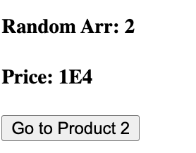

# Nuxt 3 CMS Stock Course EP.16 - Composable

## Outcome

-   Learn behaviour of `composable` in Nuxt 3
-   Learn how to use `composable` in Nuxt 3 with `components` and `pages`

## Documentation for this episode

https://nuxt.com/docs/guide/directory-structure/composables

## Setup

1. Create `composables` folder in `~/` directory

2. Create `~/composables/usePingpong.ts`

```ts
/* composables/usePingpong.ts */

export const usePingpong = () => {
    return {
        ping: () => "pong",
        pong: () => "ping",
    };
};
```

3. Create `~/pages/demo/composables.vue` and add code following

```vue
<template>
    <div>
        {{ ping.ping() }}
        {{ ping.pong() }}
    </div>
</template>

<script setup lang="ts">
const ping = usePingpong();
</script>

<style scoped></style>
```

4. Go check `http://localhost:3000/demo/composables`

## Result

This is the result of this episode


