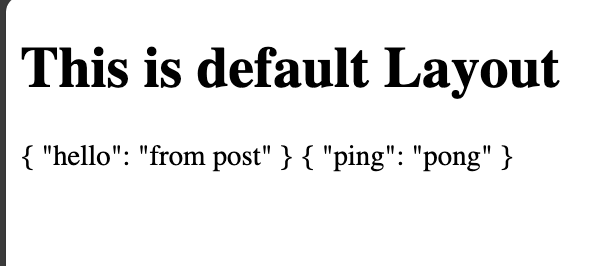
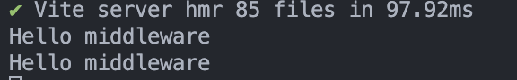

# Nuxt 3 CMS Stock Course EP.19 - Server

## Outcome

-   Learn behaviour of `Server Side Rendering` in Nuxt 3
-   Learn when we have to use `Server Side Rendering` in Nuxt 3
-   Learn how to implement `Server Side Rendering` in `components` and `pages`

## Documentation for this episode

https://nuxt.com/docs/guide/directory-structure/composables

## Setup

1. Create `server.vue` folder in `~/pages` directory and add code following to `~/pages/server.vue`

```vue
<template>
    <div>
        {{ response.data }}
        {{ responsePingPong.data }}
    </div>
</template>

<script setup lang="ts">
const response = await useFetch("/api/hello", {
    method: "POST",
});
const responsePingPong = await useFetch("/ping", {
    method: "POST",
});
</script>

<style scoped></style>
```

2. Create `server` folder in `~`

3. Create `hello.ts` and `hello.post.ts` files in `~/server/api` directory and add code following

```ts
/* server/api/hello.ts */
export default defineEventHandler((event) => {
    return {
        hello: "from get",
    };
});
```

```ts
/* server/api/hello.post.ts */
export default defineEventHandler((event) => {
    return {
        hello: "from post",
    };
});
```

3. Create `ping.ts` file in `~/server/routes` directory and add code following

```ts
export default defineEventHandler((event) => {
    return {
        ping: "pong",
    };
});
```

4. Create `hello.ts` (middleware) file in `~/server/middleware` directory and add code following

```ts
export default fromNodeMiddleware((req, res, next) => {
    console.log("Hello middleware");
    next();
});
```

5. Go visit `http://localhost:3000/demo/server` and see the result

## Result

-   Browser



-   Terminal


