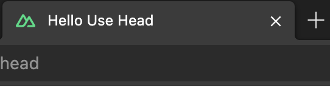

# Nuxt 3 CMS Stock Course EP.22 - useSeoMeta

## Outcome

-   Learn how to use `useSeoMeta` composable
-   Learn how to set `title`, `meta` and `link` tags
-   Learn `meta` tags for `twitter` and `facebook`

## Documentation for this episode

https://nuxt.com/docs/api/composables/use-seo-meta

## Setup

1. Create `use-seo-meta.vue` folder inside `~/pages/demo/composables` folder and add code below

```vue
<template>
    <div>Test SEO</div>
</template>

<script setup lang="ts">
useSeoMeta({
    title: "My Amazing Site", // default title
    ogTitle: "My Amazing Site", // will be used for og:title
    description: "This is my amazing site, let me tell you all about it.", // default description
    ogDescription: "This is my amazing site, let me tell you all about it.", // will be used for og:description
    ogImage: "https://example.com/image.png", // will be used for og:image (show image when post facebook, line)
    twitterTitle: "My Amazing Site", // will be used for twitter:title
    twitterDescription:
        "This is my amazing site, let me tell you all about it.", // will be used for twitter:description
    twitterImage: "https://example.com/image.png", // will be used for twitter:image (show image when post twitter)
    twitterCard: "summary_large_image", // will be used for twitter:card
});
</script>

<style scoped></style>
```

## Result

When we visit `http://localhost:3000/demo/composables/use-seo-meta` we should see following result



In inspect element we should see following result


