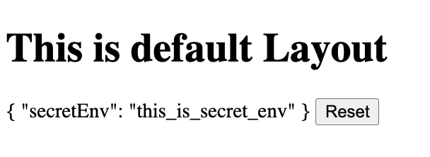

# Nuxt 3 CMS Stock Course EP.24 - useLazyFetch

## Outcome

-   Learn what is `useLazyFetch` composable
-   Learn how to use `useLazyFetch` composable
-   Learn how to use `useLazyFetch` composable in `client` and `server`
-   Learn what is difference between `useFetch` and `useLazyFetch`

## Documentation for this episode

https://nuxt.com/docs/api/composables/use-lazy-fetch

## Setup

1. Create `use-lazy-fetch.vue` folder inside `~/pages/demo/composables` folder and add code below

```vue
<template>
    <div>
        <div v-if="pending">Loading ...</div>
        <div v-else>
            {{ secretEnvResp }}
            <button @click="secretEnvResp = null">Reset</button>
        </div>
    </div>
</template>

<script setup lang="ts">
/* Navigation will occur before fetching is complete.
  Handle pending and error states directly within your component's template
*/
const { pending, data: secretEnvResp } = await useLazyFetch("/api/secret-env");
watch(secretEnvResp, (newPosts) => {
    console.log("newPosts", newPosts);

    // Because posts might start out null, you won't have access
    // to its contents immediately, but you can watch it.
});
</script>

<style scoped></style>
```

2. Go visit `http://localhost:3000/demo/composables/use-lazy-fetch` and we should see following result

## Result

When we visit `http://localhost:3000/demo/composables/use-lazy-fetch` we should see following result


