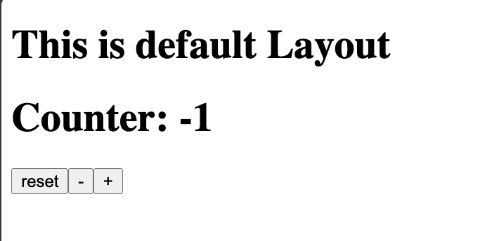
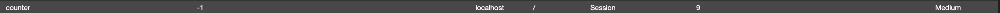

# Nuxt 3 CMS Stock Course EP.26 - useCookie

## Outcome

-   Learn what is `useCookie` composable
-   Learn how to use `useCookie` composable
-   Learn how to use `useCookie` composable in `client` and `server`

## Documentation for this episode

https://nuxt.com/docs/api/composables/use-cookie

## Setup

1. Create `use-cookie.vue` folder inside `~/pages/demo/composables` folder and add code below

```vue
<template>
    <div>
        <h1>Counter: {{ counterCookie || "-" }}</h1>
        <button @click="counterCookie = -1">reset</button>
        <button @click="counterCookie--">-</button>
        <button @click="counterCookie++">+</button>
    </div>
</template>

<script setup lang="ts">
const counterCookie = useCookie<number>("counter", {});
</script>

<style scoped></style>
```

2. Go visit `http://localhost:3000/demo/composables/use-cookie` and we should see following result

## Result

When we visit `http://localhost:3000/demo/composables/use-cookie` we should see following result



In `Application` tab we should see following result


