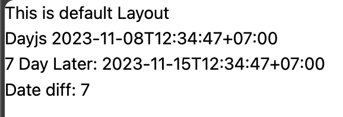

# Nuxt 3 CMS Stock Course EP.31 - Module Dayjs

## Outcome

-   Understand how to install `Dayjs` in Nuxt 3 (Module)
-   Understand how to use `Dayjs` in Nuxt 3

## Documentation for this episode

https://nuxt.com/modules/dayjs

## Setup

1. Add `dayjs-nuxt` dependency to your project

```bash
# Using pnpm
pnpm add -D dayjs-nuxt
# Using yarn
yarn add --dev dayjs-nuxt
# Using npm
npm install --save-dev dayjs-nuxt
```

2. Add `dayjs-nuxt` to the `modules` section of `nuxt.config.ts`

```ts
{
    modules: ["dayjs-nuxt"];
}
```

3. Create `~/pages/demo/modules/dayjs.vue` file

```vue
<template>
    <div>
        Dayjs {{ $dayjs().format() }}
        <p>7 Day Later: {{ sevenDayLater.format() }}</p>
        <p>Date diff: {{ dateDiff }}</p>
    </div>
</template>

<script setup lang="ts">
const dayjs = useDayjs();

const sevenDayLater = dayjs().add(7, "day");
const dateDiff = sevenDayLater.diff(dayjs(), "day");
</script>

<style scoped></style>
```

5. Go visit `/demo/modules/dayjs` and see the result

## Result

When we visit `http://localhost:3000/demo/modules/dayjs` we should see following result


