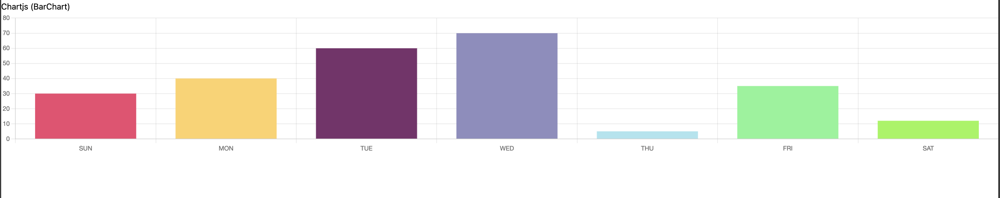

# Nuxt 3 CMS Stock Course EP.32 - Module Chartjs

## Outcome

-   Understand how to install `Chartjs` in Nuxt 3 (Module)
-   Understand how to use `Chartjs` in Nuxt 3

## Documentation for this episode

https://www.chartjs.org/

## Setup

1. Add `Chartjs` dependency to your project

```bash
npm install chartjs

npm install vue-chart-3
```

2. Create `chartjs.client.ts` to the `~/plugins` folder

```ts
// ~/plugins/chartjs.client.ts

import { defineNuxtPlugin } from "#app";
import { Chart, registerables } from "chart.js";
import VueChart3 from "vue-chart-3";
Chart.register(...registerables);

export default defineNuxtPlugin((nuxtApp) => {
    //   nuxtApp.vueApp.component("VueChart3", VueChart3);
    nuxtApp.vueApp.config.globalProperties.$Chart = Chart;
});
```

3. Create `~/pages/demo/modules/chartjs.vue` file

```vue
<template>
    <div>
        <h1>Chartjs (BarChart)</h1>
        <BarChart
            v-bind="barChartProps"
            :options="options"
            class="tw-h-full md:tw-max-h-[270px]"
        />
    </div>
</template>

<script setup lang="ts">
import { BarChart, useBarChart } from "vue-chart-3";
const lineData = ref([30, 40, 60, 70, 5, 35, 12, 75, 42, 33, 10, 2]);

const options = ref({
    responsive: true,
    plugins: {
        legend: {
            position: "top",
            display: false,
        },
        title: {
            display: false,
            text: "Monthly",
        },
    },
});

const chartData = computed(() => ({
    labels: ["SUN", "MON", "TUE", "WED", "THU", "FRI", "SAT"],
    datasets: [
        {
            data: lineData.value as any,
            backgroundColor: [
                "#EF476F",
                "#FFD166",
                "#7A306C",
                "#8E8DBE",
                "#A9E4EF",
                "#81F495",
                "#96F550",
            ],
        },
    ],
}));

const { barChartProps, barChartRef } = useBarChart({
    chartData,
});
</script>

<style scoped></style>
```

4. Go visit `/demo/modules/chartjs` and see the result

## Result

When we visit `http://localhost:3000/demo/modules/chartjs` we should see following result


