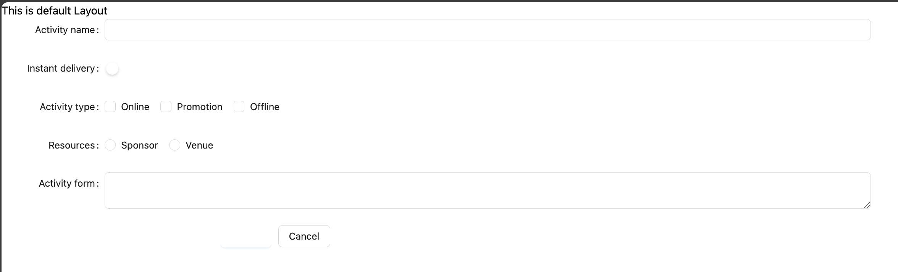

# Nuxt 3 CMS Stock Course EP.33 - Module Antdv

## Outcome

-   Understand how to install `Ant Design Vue` in Nuxt 3 (Module)
-   Understand how to use `Ant Design Vue` in Nuxt 3

## Documentation for this episode

https://nuxt.com/modules/ant-design-vue

## Setup

1. Add `@ant-design-vue/nuxt` dependency to your project

```bash
# Using pnpm
pnpm add -D @ant-design-vue/nuxt
# Using yarn
yarn add --dev @ant-design-vue/nuxt
# Using npm
npm install --save-dev @ant-design-vue/nuxt
```

2. Add `@ant-design-vue/nuxt` to the `modules` section of `nuxt.config.ts`

```ts
// nuxt.config.ts

export default defineNuxtConfig({
    modules: ["@ant-design-vue/nuxt"],
    antd: {
        // Options
    },
});
```

3. Create `~/pages/demo/modules/antdv.vue` file

```vue
<template>
    <a-form :model="formState" :label-col="labelCol" :wrapper-col="wrapperCol">
        <a-form-item label="Activity name">
            <a-input v-model:value="formState.name" />
        </a-form-item>
        <a-form-item label="Instant delivery">
            <a-switch v-model:checked="formState.delivery" />
        </a-form-item>
        <a-form-item label="Activity type">
            <a-checkbox-group v-model:value="formState.type">
                <a-checkbox value="1" name="type">Online</a-checkbox>
                <a-checkbox value="2" name="type">Promotion</a-checkbox>
                <a-checkbox value="3" name="type">Offline</a-checkbox>
            </a-checkbox-group>
        </a-form-item>
        <a-form-item label="Resources">
            <a-radio-group v-model:value="formState.resource">
                <a-radio value="1">Sponsor</a-radio>
                <a-radio value="2">Venue</a-radio>
            </a-radio-group>
        </a-form-item>
        <a-form-item label="Activity form">
            <a-textarea v-model:value="formState.desc" />
        </a-form-item>
        <a-form-item :wrapper-col="{ span: 14, offset: 4 }">
            <a-button type="primary" @click="onSubmit">Create</a-button>
            <a-button style="margin-left: 10px">Cancel</a-button>
        </a-form-item>
    </a-form>
</template>
<script lang="ts" setup>
import { reactive, toRaw } from "vue";
import type { UnwrapRef } from "vue";

interface FormState {
    name: string;
    delivery: boolean;
    type: string[];
    resource: string;
    desc: string;
}
const formState: UnwrapRef<FormState> = reactive({
    name: "",
    delivery: false,
    type: [],
    resource: "",
    desc: "",
});
const onSubmit = () => {
    console.log("submit!", toRaw(formState));
};
const labelCol = { style: { width: "150px" } };
const wrapperCol = { span: 14 };
</script>
```

4. Go visit `/demo/modules/antdv` and see the result

## Result

When we visit `http://localhost:3000/demo/modules/antdv` we should see following result


