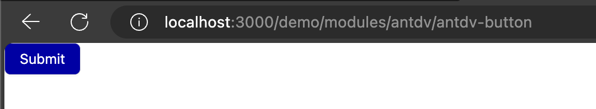

# Nuxt 3 CMS Stock Course EP.36 - Antdv Button

## Outcome

-   [x] Introduction to Antdv Button
-   [x] Setup Antdv Button

## Documentation for this episode

https://antdv.com/components/icon

## Setup

1. Update file in `~pages/demo/modules/antdv/antdv-button.vue` and change code to below

```vue
<template>
    <div>
        Theme
        <a-button
            :style="{
                backgroundColor: token.colorPrimary,
                color: '#fff',
            }"
            >Submit</a-button
        >
        <div class="tw-mt-6"></div>
        <hr />
        <div class="tw-py-6">
            <h1 class="tw-text-2xl">Type</h1>
            <a-space wrap>
                <a-button type="primary">Primary Button</a-button>
                <a-button>Default Button</a-button>
                <a-button type="dashed">Dashed Button</a-button>
                <a-button type="text">Text Button</a-button>
                <a-button type="link">Link Button</a-button>
            </a-space>
            <h1 class="tw-text-2xl">Disabled</h1>
            <a-space wrap>
                <a-button type="primary">Primary Button</a-button>
                <a-button type="primary" disabled>Primary Button</a-button>
            </a-space>
            <div
                :style="{
                    background: 'rgb(190, 200, 200)',
                    padding: '16px 16px',
                    marginTop: '16px',
                }"
            >
                <h1 class="tw-text-2xl">Ghost</h1>

                <a-space>
                    <a-button type="primary" ghost>Primary</a-button>
                    <a-button>Default</a-button>
                    <a-button type="dashed" ghost>Dashed</a-button>
                    <a-button type="primary" danger ghost>Danger</a-button>
                </a-space>
            </div>
            <h1 class="tw-text-2xl">Danger</h1>

            <a-space warp>
                <a-button type="primary" danger>Primary</a-button>
                <a-button danger>Default</a-button>
                <a-button type="dashed" danger>Dashed</a-button>
                <a-button type="text" danger>Text</a-button>
                <a-button type="link" danger>Link</a-button>
            </a-space>

            <h1 class="tw-text-2xl">Icon</h1>

            <a-space warp>
                <a-tooltip title="search">
                    <a-button
                        type="primary"
                        shape="circle"
                        :icon="h(SearchOutlined)"
                    />
                </a-tooltip>
                <a-button type="primary" shape="circle">A</a-button>
                <a-button type="primary" :icon="h(SearchOutlined)"
                    >Search</a-button
                >
                <a-tooltip title="search">
                    <a-button shape="circle" :icon="h(SearchOutlined)" />
                </a-tooltip>
                <a-button :icon="h(SearchOutlined)">Search</a-button>
            </a-space>
            <h1 class="tw-text-2xl">Block</h1>
            <a-button type="primary" danger block>Primary</a-button>

            <h1 class="tw-text-2xl">Loading</h1>
            <a-button type="primary" danger loading>Loading</a-button>
        </div>
    </div>
</template>

<script setup lang="ts">
import { theme } from "ant-design-vue";
import { SearchOutlined } from "@ant-design/icons-vue";
const { useToken } = theme;
const { token } = useToken();

const handleMenuClick: MenuProps["onClick"] = (e) => {
    console.log("click", e);
};
</script>

<style scoped></style>
```

3. Go visit `http://localhost:3000/demo/modules/antdv/antdv-button` and see the result

## Result

When we visit `http://localhost:3000/demo/modules/antdv/antdv-button` we should see following result


