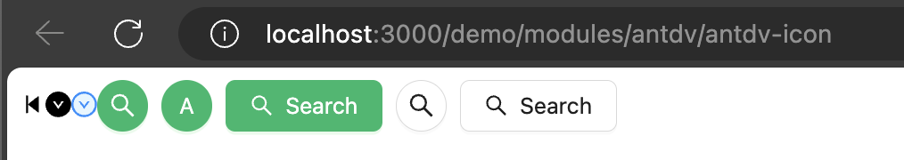

# Nuxt 3 CMS Stock Course EP.37 - Antdv Icon

## Outcome

-   [x] Introduction to Antdv Icon
-   [x] Setup Antdv Icon

## Documentation for this episode

https://antdv.com/components/icon

## Setup

1. Update file in `~pages/demo/modules/antdv/antdv-icon.vue` and change code to below

```vue
<template>
    <div>
        <StepBackwardFilled />
        <DownCircleFilled />
        <DownCircleTwoTone />
        <a-space warp>
            <a-tooltip title="search">
                <a-button
                    type="primary"
                    shape="circle"
                    :icon="h(SearchOutlined)"
                />
            </a-tooltip>
            <a-button type="primary" shape="circle">A</a-button>
            <a-button type="primary" :icon="h(SearchOutlined)">Search</a-button>
            <a-tooltip title="search">
                <a-button shape="circle" :icon="h(SearchOutlined)" />
            </a-tooltip>
            <a-button :icon="h(SearchOutlined)">Search</a-button>
        </a-space>
    </div>
</template>

<script setup lang="ts">
import { SearchOutlined } from "@ant-design/icons-vue";
</script>

<style scoped></style>
```

3. Go visit `http://localhost:3000/demo/modules/antdv/antdv-icon` and see the result

## Result

When we visit `http://localhost:3000/demo/modules/antdv/antdv-icon` we should see following result


