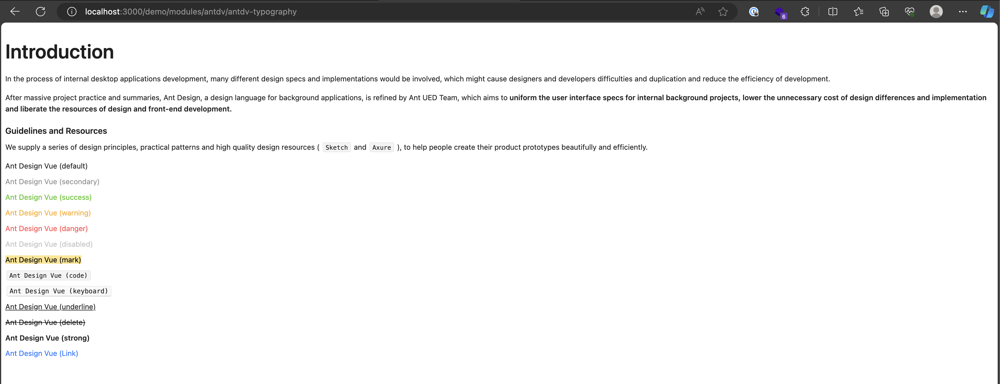

# Nuxt 3 CMS Stock Course EP.36 - Antdv Typography

## Outcome

-   [x] Introduction to Antdv Typography
-   [x] Setup Antdv Typography

## Documentation for this episode

https://antdv.com/components/typography

## Setup

1. Update file in `~pages/demo/modules/antdv/antdv-typography.vue` and change code to below

```vue
<template>
    <div>
        <a-typography>
            <a-typography-title>Introduction</a-typography-title>
            <a-typography-paragraph>
                In the process of internal desktop applications development,
                many different design specs and implementations would be
                involved, which might cause designers and developers
                difficulties and duplication and reduce the efficiency of
                development.
            </a-typography-paragraph>
            <a-typography-paragraph>
                After massive project practice and summaries, Ant Design, a
                design language for background applications, is refined by Ant
                UED Team, which aims to
                <a-typography-text strong>
                    uniform the user interface specs for internal background
                    projects, lower the unnecessary cost of design differences
                    and implementation and liberate the resources of design and
                    front-end development.
                </a-typography-text>
            </a-typography-paragraph>
            <a-typography-title :level="5"
                >Guidelines and Resources</a-typography-title
            >
            <a-typography-paragraph>
                We supply a series of design principles, practical patterns and
                high quality design resources (
                <a-typography-text code>Sketch</a-typography-text>
                and
                <a-typography-text code>Axure</a-typography-text>
                ), to help people create their product prototypes beautifully
                and efficiently.
            </a-typography-paragraph>
            <template>
                <a-space direction="vertical">
                    <a-typography-text
                        >Ant Design Vue (default)</a-typography-text
                    >
                    <a-typography-text type="secondary"
                        >Ant Design Vue (secondary)</a-typography-text
                    >
                    <a-typography-text type="success"
                        >Ant Design Vue (success)</a-typography-text
                    >
                    <a-typography-text type="warning"
                        >Ant Design Vue (warning)</a-typography-text
                    >
                    <a-typography-text type="danger"
                        >Ant Design Vue (danger)</a-typography-text
                    >
                    <a-typography-text disabled
                        >Ant Design Vue (disabled)</a-typography-text
                    >
                    <a-typography-text mark
                        >Ant Design Vue (mark)</a-typography-text
                    >
                    <a-typography-text code
                        >Ant Design Vue (code)</a-typography-text
                    >
                    <a-typography-text keyboard
                        >Ant Design Vue (keyboard)</a-typography-text
                    >
                    <a-typography-text underline
                        >Ant Design Vue (underline)</a-typography-text
                    >
                    <a-typography-text delete
                        >Ant Design Vue (delete)</a-typography-text
                    >
                    <a-typography-text strong
                        >Ant Design Vue (strong)</a-typography-text
                    >
                    <a-typography-link href="https://antdv.com" target="_blank">
                        Ant Design Vue (Link)
                    </a-typography-link>
                </a-space>
            </template>
        </a-typography>
    </div>
</template>

<script setup lang="ts"></script>

<style scoped></style>
```

3. Go visit `http://localhost:3000/demo/modules/antdv/antdv-typography` and see the result

## Result

When we visit `http://localhost:3000/demo/modules/antdv/antdv-typography` we should see following result


