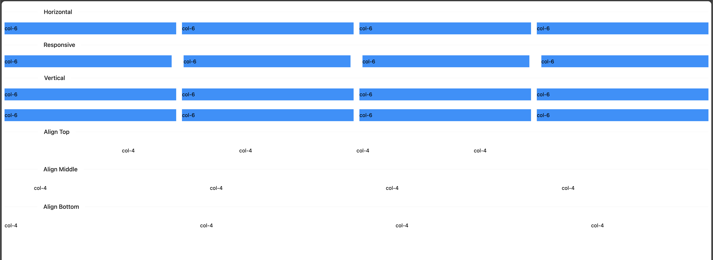

# Nuxt 3 CMS Stock Course EP.39 - Antdv Grid

## Outcome

-   [x] Introduction to Antdv Grid
-   [x] Used Antdv Grid
-   [x] Used Antdv Grid with Gutter

## Documentation for this episode

https://antdv.com/components/grid

## Setup

1. Update file in `~pages/demo/modules/antdv/antdv-grid.vue` and change code to below

```vue
<template>
    <a-divider orientation="left">Horizontal</a-divider>
    <a-row :gutter="16">
        <a-col class="gutter-row" :span="6">
            <div class="gutter-box">col-6</div>
        </a-col>
        <a-col class="gutter-row" :span="6">
            <div class="gutter-box">col-6</div>
        </a-col>
        <a-col class="gutter-row" :span="6">
            <div class="gutter-box">col-6</div>
        </a-col>
        <a-col class="gutter-row" :span="6">
            <div class="gutter-box">col-6</div>
        </a-col>
    </a-row>
    <a-divider orientation="left">Responsive</a-divider>
    <a-row :gutter="{ xs: 8, sm: 16, md: 24, lg: 32 }">
        <a-col class="gutter-row" :span="6">
            <div class="gutter-box">col-6</div>
        </a-col>
        <a-col class="gutter-row" :span="6">
            <div class="gutter-box">col-6</div>
        </a-col>
        <a-col class="gutter-row" :span="6">
            <div class="gutter-box">col-6</div>
        </a-col>
        <a-col class="gutter-row" :span="6">
            <div class="gutter-box">col-6</div>
        </a-col>
    </a-row>
    <a-divider orientation="left">Vertical</a-divider>
    <a-row :gutter="[16, 24]">
        <a-col class="gutter-row" :span="6">
            <div class="gutter-box">col-6</div>
        </a-col>
        <a-col class="gutter-row" :span="6">
            <div class="gutter-box">col-6</div>
        </a-col>
        <a-col class="gutter-row" :span="6">
            <div class="gutter-box">col-6</div>
        </a-col>
        <a-col class="gutter-row" :span="6">
            <div class="gutter-box">col-6</div>
        </a-col>
        <a-col class="gutter-row" :span="6">
            <div class="gutter-box">col-6</div>
        </a-col>
        <a-col class="gutter-row" :span="6">
            <div class="gutter-box">col-6</div>
        </a-col>
        <a-col class="gutter-row" :span="6">
            <div class="gutter-box">col-6</div>
        </a-col>
        <a-col class="gutter-row" :span="6">
            <div class="gutter-box">col-6</div>
        </a-col>
    </a-row>
    <div id="components-grid-demo-flex-align">
        <a-divider orientation="left">Align Top</a-divider>
        <a-row justify="center" align="top">
            <a-col :span="4">
                <p class="height-100">col-4</p>
            </a-col>
            <a-col :span="4">
                <p class="height-50">col-4</p>
            </a-col>
            <a-col :span="4">
                <p class="height-120">col-4</p>
            </a-col>
            <a-col :span="4">
                <p class="height-80">col-4</p>
            </a-col>
        </a-row>

        <a-divider orientation="left">Align Middle</a-divider>
        <a-row justify="space-around" align="middle">
            <a-col :span="4">
                <p class="height-100">col-4</p>
            </a-col>
            <a-col :span="4">
                <p class="height-50">col-4</p>
            </a-col>
            <a-col :span="4">
                <p class="height-120">col-4</p>
            </a-col>
            <a-col :span="4">
                <p class="height-80">col-4</p>
            </a-col>
        </a-row>

        <a-divider orientation="left">Align Bottom</a-divider>
        <a-row justify="space-between" align="bottom">
            <a-col :span="4">
                <p class="height-100">col-4</p>
            </a-col>
            <a-col :span="4">
                <p class="height-50">col-4</p>
            </a-col>
            <a-col :span="4">
                <p class="height-120">col-4</p>
            </a-col>
            <a-col :span="4">
                <p class="height-80">col-4</p>
            </a-col>
        </a-row>
    </div>
</template>

<style scoped>
.gutter-box {
    background: #0092ff;
    padding: 8px 0;
}

:deep(#components-grid-demo-flex-align) [class~="ant-row"] {
    background: rgba(128, 128, 128, 0.08);
}
</style>
```

2. Go visit `http://localhost:3000/demo/modules/antdv/antdv-grid` and see the result

## Result

When we visit `http://localhost:3000/demo/modules/antdv/antdv-grid` we should see following result


