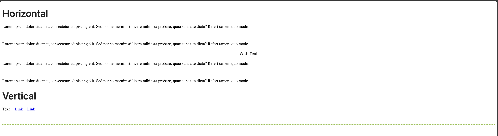

# Nuxt 3 CMS Stock Course EP.40 - Antdv Divider

## Outcome

-   [x] Introduction to Antdv Divider
-   [x] How to use Antdv Divider

## Documentation for this episode

https://antdv.com/components/divider

## Setup

1. Update file in `~pages/demo/modules/antdv/antdv-divider.vue` and change code to below

```vue
<template>
    <div>
        <a-typography-title>Horizontal</a-typography-title>

        <p>
            Lorem ipsum dolor sit amet, consectetur adipiscing elit. Sed nonne
            merninisti licere mihi ista probare, quae sunt a te dicta? Refert
            tamen, quo modo.
        </p>
        <a-divider />
        <p>
            Lorem ipsum dolor sit amet, consectetur adipiscing elit. Sed nonne
            merninisti licere mihi ista probare, quae sunt a te dicta? Refert
            tamen, quo modo.
        </p>
        <a-divider>With Text</a-divider>
        <p>
            Lorem ipsum dolor sit amet, consectetur adipiscing elit. Sed nonne
            merninisti licere mihi ista probare, quae sunt a te dicta? Refert
            tamen, quo modo.
        </p>
        <a-divider dashed />
        <p>
            Lorem ipsum dolor sit amet, consectetur adipiscing elit. Sed nonne
            merninisti licere mihi ista probare, quae sunt a te dicta? Refert
            tamen, quo modo.
        </p>
        <a-typography-title>Vertical</a-typography-title>
        <div>
            Text
            <a-divider type="vertical" />
            <a href="#">Link</a>
            <a-divider type="vertical" />
            <a href="#">Link</a>
        </div>
        <div>
            <a-divider style="height: 2px; background-color: #7cb305" />
            <a-divider style="border-color: #7cb305" dashed />
        </div>
    </div>
</template>
```

3. Go visit `http://localhost:3000/demo/modules/antdv/antdv-divider` and see the result

## Result

When we visit `http://localhost:3000/demo/modules/antdv/antdv-divider` we should see following result


