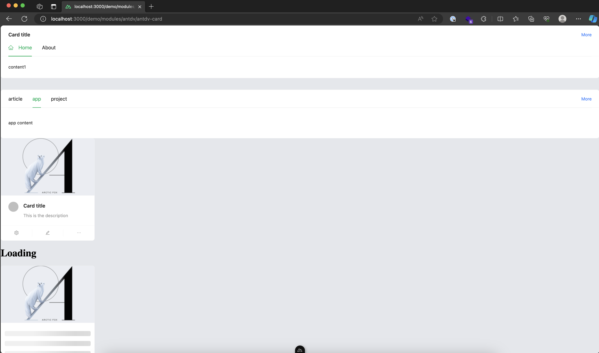

# Nuxt 3 CMS Stock Course EP.41 - Antdv Card

## Outcome

-   [x] Introduction to Antdv Card
-   [x] How to use Antdv Card

## Documentation for this episode

https://antdv.com/components/card

## Setups

1. Update file in `~pages/demo/modules/antdv/antdv-card.vue` and change code to below

```vue
<template>
    <div class="tw-h-screen tw-bg-gray-200">
        <a-card
            style="width: 100%"
            title="Card title"
            :tab-list="tabList"
            :active-tab-key="key"
            @tabChange="(key) => onTabChange(key, 'key')"
        >
            <template #customTab="item">
                <span v-if="item.key === 'tab1'">
                    <home-outlined />
                    {{ item.tab }}
                </span>
            </template>
            <template #extra>
                <a href="#">More</a>
            </template>
            {{ contentList[key] }}
        </a-card>
        <br />
        <br />
        <a-card
            style="width: 100%"
            :tab-list="tabListNoTitle"
            :active-tab-key="noTitleKey"
            @tabChange="(key) => onTabChange(key, 'noTitleKey')"
        >
            <p v-if="noTitleKey === 'article'">article content</p>
            <p v-else-if="noTitleKey === 'app'">app content</p>
            <p v-else>project content</p>
            <template #tabBarExtraContent>
                <a href="#">More</a>
            </template>
        </a-card>
        <a-card hoverable style="width: 300px">
            <template #cover>
                
            </template>
            <template #actions>
                <setting-outlined key="setting" />
                <edit-outlined key="edit" />
                <ellipsis-outlined key="ellipsis" />
            </template>
            <a-card-meta
                title="Card title"
                description="This is the description"
            >
                <template #avatar>
                    <a-avatar src="https://joeschmoe.io/api/v1/random" />
                </template>
            </a-card-meta>
        </a-card>
        <h1>Loading</h1>
        <a-card hoverable size="small" loading style="width: 300px">
            <template #cover>
                
            </template>
            <template #actions>
                <setting-outlined key="setting" />
                <edit-outlined key="edit" />
                <ellipsis-outlined key="ellipsis" />
            </template>
            <a-card-meta
                title="Card title"
                description="This is the description"
            >
                <template #avatar>
                    <a-avatar src="https://joeschmoe.io/api/v1/random" />
                </template>
            </a-card-meta>
        </a-card>
    </div>
</template>
<script lang="ts" setup>
import { HomeOutlined } from "@ant-design/icons-vue";
import { ref } from "vue";
const tabList = [
    {
        key: "tab1",
        tab: "Home",
    },
    {
        key: "tab2",
        tab: "About",
    },
];
const contentList = {
    tab1: "content1",
    tab2: "content2",
};
const tabListNoTitle = [
    {
        key: "article",
        tab: "article",
    },
    {
        key: "app",
        tab: "app",
    },
    {
        key: "project",
        tab: "project",
    },
];
const key = ref("tab1");
const noTitleKey = ref("app");

const onTabChange = (value: string, type: string) => {
    console.log(value, type);
    if (type === "key") {
        key.value = value;
    } else if (type === "noTitleKey") {
        noTitleKey.value = value;
    }
};
</script>
```

2. Go visit `http://localhost:3000/demo/modules/antdv/antdv-card` and see the result

## Result

When we visit `http://localhost:3000/demo/modules/antdv/antdv-card` we should see following result


