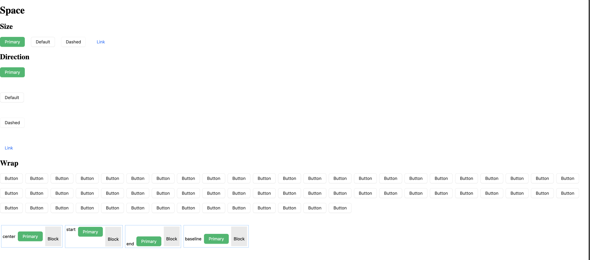

# Nuxt 3 CMS Stock Course EP.42 - Antdv Space

## Outcome

-   [x] Introduction to Antdv Space
-   [x] How to use Antdv Space

## Documentation for this episode

https://antdv.com/components/space

## Setup

1. Update file in `~pages/demo/modules/antdv/antdv-space.vue` and change code to below

```vue
<template>
    <div>
        <h1>Space</h1>
        <h2>Size</h2>
        <a-space :size="size">
            <a-button type="primary">Primary</a-button>
            <a-button>Default</a-button>
            <a-button type="dashed">Dashed</a-button>
            <a-button type="link">Link</a-button>
        </a-space>
        <h2>Direction</h2>
        <a-space direction="vertical" :size="50">
            <a-button type="primary">Primary</a-button>
            <a-button>Default</a-button>
            <a-button type="dashed">Dashed</a-button>
            <a-button type="link">Link</a-button>
        </a-space>
        <h2>Wrap</h2>
        <a-space :size="[8, 16]" wrap>
            <template v-for="_i in 60" :key="_i">
                <a-button>Button</a-button>
            </template>
        </a-space>
        <div class="space-align-container tw-mt-12">
            <div class="space-align-block">
                <a-space align="center">
                    center
                    <a-button type="primary">Primary</a-button>
                    <span class="mock-block">Block</span>
                </a-space>
            </div>
            <div class="space-align-block">
                <a-space align="start">
                    start
                    <a-button type="primary">Primary</a-button>
                    <span class="mock-block">Block</span>
                </a-space>
            </div>
            <div class="space-align-block">
                <a-space align="end">
                    end
                    <a-button type="primary">Primary</a-button>
                    <span class="mock-block">Block</span>
                </a-space>
            </div>
            <div class="space-align-block">
                <a-space align="baseline">
                    baseline
                    <a-button type="primary">Primary</a-button>
                    <span class="mock-block">Block</span>
                </a-space>
            </div>
        </div>
    </div>
</template>

<script setup lang="ts">
const size = ref(20);
</script>

<style scoped>
.space-align-container {
    display: flex;
    align-items: flex-start;
    flex-wrap: wrap;
}
.space-align-block {
    margin: 8px 4px;
    border: 1px solid #40a9ff;
    padding: 4px;
    flex: none;
}
.space-align-block .mock-block {
    display: inline-block;
    padding: 32px 8px 16px;
    background: rgba(150, 150, 150, 0.2);
}
</style>
```

3. Go visit `http://localhost:3000/demo/modules/antdv/antdv-space` and see the result

## Result

When we visit `http://localhost:3000/demo/modules/antdv/antdv-space` we should see following result


