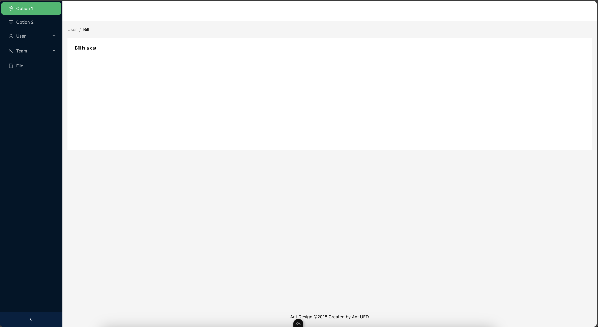

# Nuxt 3 CMS Stock Course EP.43 - Antdv Layout

## Outcome

-   [x] Introduction to Antdv Layout
-   [x] How to use Antdv Layout

## Documentation for this episode

https://antdv.com/components/layout

## Setup

1. Update file in `~pages/demo/modules/antdv/antdv-layout.vue` and change code to below

```vue
<template>
    <a-layout style="min-height: 100vh; max-height: 100vw">
        <a-layout-sider v-model:collapsed="collapsed" collapsible>
            <div class="logo" />
            <a-menu
                v-model:selectedKeys="selectedKeys"
                theme="dark"
                mode="inline"
            >
                <a-menu-item key="1">
                    <pie-chart-outlined />
                    <span>Option 1</span>
                </a-menu-item>
                <a-menu-item key="2">
                    <desktop-outlined />
                    <span>Option 2</span>
                </a-menu-item>
                <a-sub-menu key="sub1">
                    <template #title>
                        <span>
                            <user-outlined />
                            <span>User</span>
                        </span>
                    </template>
                    <a-menu-item key="3">Tom</a-menu-item>
                    <a-menu-item key="4">Bill</a-menu-item>
                    <a-menu-item key="5">Alex</a-menu-item>
                </a-sub-menu>
                <a-sub-menu key="sub2">
                    <template #title>
                        <span>
                            <team-outlined />
                            <span>Team</span>
                        </span>
                    </template>
                    <a-menu-item key="6">Team 1</a-menu-item>
                    <a-menu-item key="8">Team 2</a-menu-item>
                </a-sub-menu>
                <a-menu-item key="9">
                    <file-outlined />
                    <span>File</span>
                </a-menu-item>
            </a-menu>
        </a-layout-sider>
        <a-layout>
            <a-layout-header style="background: #fff; padding: 0" />
            <a-layout-content style="margin: 0 16px">
                <a-breadcrumb style="margin: 16px 0">
                    <a-breadcrumb-item>User</a-breadcrumb-item>
                    <a-breadcrumb-item>Bill</a-breadcrumb-item>
                </a-breadcrumb>
                <div
                    :style="{
                        padding: '24px',
                        background: '#fff',
                        minHeight: '360px',
                    }"
                >
                    Bill is a cat.
                </div>
            </a-layout-content>
            <a-layout-footer style="text-align: center">
                Ant Design ©2018 Created by Ant UED
            </a-layout-footer>
        </a-layout>
    </a-layout>
</template>
<script lang="ts" setup>
import {
    PieChartOutlined,
    DesktopOutlined,
    UserOutlined,
    TeamOutlined,
    FileOutlined,
} from "@ant-design/icons-vue";
import { ref } from "vue";
const collapsed = ref<boolean>(false);
const selectedKeys = ref<string[]>(["1"]);
</script>
<style scoped>
#components-layout-demo-side .logo {
    height: 32px;
    margin: 16px;
    background: rgba(255, 255, 255, 0.3);
}

.site-layout .site-layout-background {
    background: #fff;
}
[data-theme="dark"] .site-layout .site-layout-background {
    background: #141414;
}
</style>
```

3. Go visit `http://localhost:3000/demo/modules/antdv/antdv-layout` and see the result

## Result

When we visit `http://localhost:3000/demo/modules/antdv/antdv-layout` we should see following result


