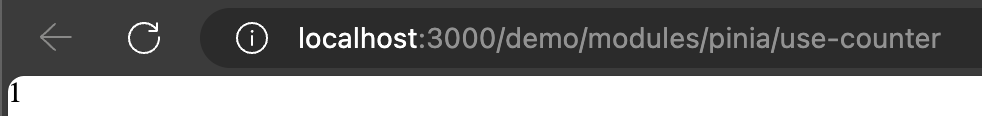

# Nuxt 3 CMS Stock Course EP.44 - Pinia State

## Outcome

-   [x] Introduction to Pinia State
-   [x] How to use Pinia State

## Documentation for this episode

https://pinia.vuejs.org/core-concepts/state.html

## Setup

1. Create file in `~stores/demo/counter.store.ts` and change code to below

```ts
export const useCounterStore = defineStore("counter", {
    // other options...
    state: () => ({
        count: 1,
    }),
});
```

2. Create file in `~pages/demo/modules/pinia/use-counter.vue` and change code to below

```vue
<template>
    <div>
        {{ counter.count }}
    </div>
</template>

<script setup lang="ts">
const counter = useCounterStore();
</script>

<style scoped></style>
```

3. Go visit `http://localhost:3000/demo/modules/pinia/use-counter` and see the result

## Result

When we visit `http://localhost:3000/demo/modules/pinia/use-counter` we should see following result


