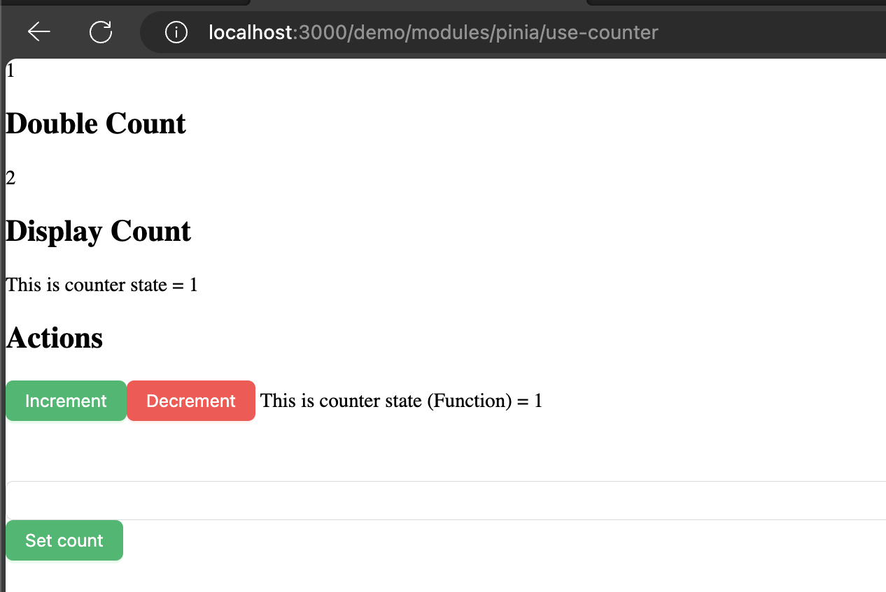

# Nuxt 3 CMS Stock Course EP.46 - Pinia Actions

## Outcome

-   [x] Introduction to Pinia Actions
-   [x] How to use Pinia Actions

## Documentation for this episode

https://pinia.vuejs.org/core-concepts/actions.html

## Setup

1. Update file in `~stores/demo/counter.store.ts` and change code to below

```ts
export const useCounterStore = defineStore("counter", {
    // other options...
    state: () => ({
        count: 1,
    }),
    getters: {
        doubleCount(): number {
            return this.count * 2;
        },
        displayCounterText(): String {
            return `This is counter state = ${this.count}`;
        },
    },
    actions: {
        increment() {
            this.count++;
        },
        decrement() {
            this.count--;
        },
        displayCounterTextFunc(): String {
            return `This is counter state (Function) = ${this.count}`;
        },
        setCount(count: number) {
            this.count = count;
        },
    },
});
```

2. Update file in `~pages/demo/modules/pinia/use-counter.vue` and change code to below

```vue
<template>
    <div>
        {{ counter.count }}
        <h2>Double Count</h2>
        {{ counter.doubleCount }}
        <h2>Display Count</h2>
        {{ counter.displayCounterText }}
        <h2>Actions</h2>
        <a-button type="primary" @click="onClickIncrement">Increment</a-button>
        <a-button type="primary" danger @click="onClickDecrement"
            >Decrement</a-button
        >
        {{ counter.displayCounterTextFunc() }}
        <div class="tw-mt-12"></div>
        <a-input v-model:value="count">Count</a-input>
        <a-button type="primary" @click="onClickSetCount">Set count</a-button>
    </div>
</template>

<script setup lang="ts">
const count = ref("");
const counter = useCounterStore();

const onClickIncrement = () => {
    counter.increment();
};

const onClickDecrement = () => {
    counter.decrement();
};

const onClickSetCount = () => {
    console.log(count.value);

    counter.setCount(Number(count.value));
};
</script>

<style scoped></style>
```

3. Go visit `http://localhost:3000/demo/modules/pinia/use-counter` and see the result

## Result

When we visit `http://localhost:3000/demo/modules/pinia/use-counter` we should see following result


