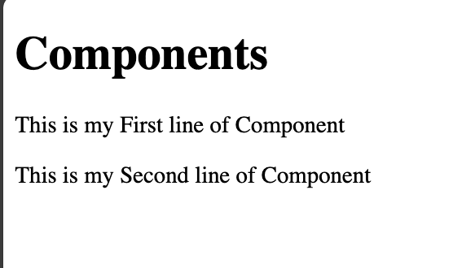

# Nuxt 3 CMS Stock Course EP.10 - Component

## Outcome

-   Understand how to create component
-   Understand how to use component

## Documentation for Component

https://nuxt.com/docs/guide/directory-structure/components

## Setup

1. Create `components/demo` folder in root folder

```
(project)/
| --- components/
|      | --- demo/
```

2. Create `MyComponentOne.vue` file in `components/demo` folder

```vue
<template>
    <div>
        <h1>Components</h1>
        <p>This is my First line of Component</p>
        <p>This is my Second line of Component</p>
    </div>
</template>

<script setup lang="ts"></script>

<style scoped></style>
```

3. Create `component.vue` in `pages/demo/` folder

```vue
<template>
    <div>
        <!-- This is how to use component -->
        <DemoMyComponentOne></DemoMyComponentOne>
    </div>
</template>

<script setup lang="ts"></script>

<style scoped></style>
```

4. Go to `http://localhost:3000/demo/component`

## Result

This is the result of display with component in `component.vue`


