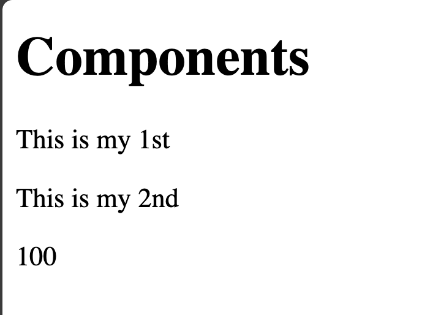

# Nuxt 3 CMS Stock Course EP.11 - Props in Component

## Outcome

-   Learn how to use props in component
-   Learn how to use `defineProps` in component

## Documentation for Component

https://nuxt.com/docs/guide/directory-structure/components

## Setup

1. Add following in `MyComponentOne.vue`

```vue
/* components/demo/MyComponentOne.vue */

<template>
    <div>
        <h1>Components</h1>
        <p>{{ firstLine }}</p>
        <p>{{ secondLine }}</p>
        <p>{{ balance }}</p>
    </div>
</template>

<script setup lang="ts">
//* Author, Date: 9/9/2021
const props = defineProps({
    firstLine: {
        type: String,
        required: true,
        default: "This is my First line of Component",
    },
    secondLine: {
        type: String,
        required: false,
        default: "This is my Second line of Component",
    },
    balance: {
        type: Number,
        required: false,
        default: 0,
    },
});
</script>

<style scoped></style>
```

2. Add following in `components.vue`

```vue
/* pages/component.vue */

<template>
    <div>
        <DemoMyComponentOne
            first-line="This is my 1st"
            second-line="This is my 2nd"
            :balance="100"
        ></DemoMyComponentOne>
    </div>
</template>

<script setup lang="ts"></script>

<style scoped></style>
```

3. Go to `http://localhost:3000/demo/component`

## Result

This is the result of display with component in `component.vue`


