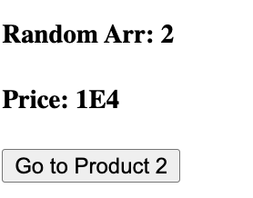

# Nuxt 3 CMS Stock Course EP.15 - Utils

## Outcome

-   Learn behaviour of `utils` in Nuxt 3
-   Learn how to use `utils` in Nuxt 3 with `components`

## Documentation for Component

https://nuxt.com/docs/guide/directory-structure/layouts

## Setup

1. Create `utils` folder in `~/` directory

2. Create `index.ts` (for formatNumber) and `random-entry.vue` (for random number in array) in `~/utils` directory

```ts
/* utils/index.ts */

export const { format: formatNumber } = Intl.NumberFormat("en-GB", {
    notation: "scientific", // standard, scientific, engineering, compact. You can pick one of these
    maximumFractionDigits: 1,
});
```

```ts
/* utils/random-entry.vue */

export default function (arr: Array<any>) {
    return arr[Math.floor(Math.random() * arr.length)];
}
```

3. Add following code to `~/pages/demo/product/[id].vue`

```vue
<template>
    <div>
        ... ...
        <h4>Random Arr: {{ randomEntry(arr) }}</h4>
        <!-- randomEntry is a function from utils/random-entry.vue -->
        <h4>Price: {{ formatNumber(10000) }}</h4>
        <!-- formatNumber is a function from utils/index.ts -->
        ... ...
    </div>
</template>

<script setup lang="ts">
definePageMeta({
    layout: "demo-product",
});

const route = useRoute();
const router = useRouter();

const arr = [1, 2, 3, 4, 5];

const goTo = (id: string) => {
    router.push(`/demo/product/${id}?color=red&brand=A`);
    // router.push({
    //     path: `/demo/product/${id}`,
    //     query: {
    //         color: "red",
    //         brand: "A",
    //     },
    // });
};
</script>

<style scoped>
.active {
    color: red;
}
</style>
```

4. Go to `http://localhost:3000/demo/product/1`

## Result

This is the result of `~/pages/demo/product/[id].vue`


