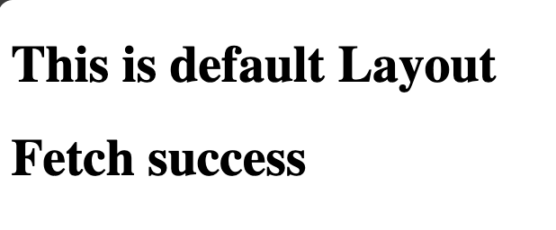

# Nuxt 3 CMS Stock Course EP.18 - useFetch

## Outcome

-   Learn behaviour of `useFetch` in Nuxt 3
-   Learn when we have to use `useFetch` in Nuxt 3
-   Learn how to implement `useFetch` in `components` and `pages`

## Documentation for this episode

https://nuxt.com/docs/api/composables/use-fetch

## Setup

1. Create `ofetch.vue` folder in `~/pages/demo/` directory

2. Add code following to `~/pages/demo/ofetch.vue`

```vue
<template>
    <div>
        <h1 v-if="pending">Loading....</h1>
        <h1 else>Fetch success</h1>
    </div>
</template>

<script setup lang="ts">
const {
    data: gitHubProfile,
    pending,
    error,
} = await useFetch(`https://api.github.com/users/alonespace`, {});
</script>

<style scoped></style>
```

3. Visit `http://localhost:3000/demo/ofetch`

## Result

When we visit `http://localhost:3000/demo/ofetch` the page will show `Loading....` and after that it will show `Fetch success`


