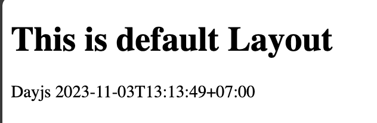

# Nuxt 3 CMS Stock Course EP.20 - Introduction Module

## Outcome

-   Introduction Module
-   Learn how to install module in Nuxt 3
-   Learn how to use module in Nuxt 3

## Documentation for this episode

https://nuxt.com/modules/dayjs

## Setup

1. Add `dayjs-nuxt` dependency to your project

```bash
# Using pnpm
pnpm add -D dayjs-nuxt
# Using yarn
yarn add --dev dayjs-nuxt
# Using npm
npm install --save-dev dayjs-nuxt
```

2. Add `dayjs-nuxt` to the modules section of `nuxt.config.ts`

```ts
export default defineNuxtConfig({
    modules: ["dayjs-nuxt"],
});
```

3. Create `dayjs.vue` in `pages/demo/modules` folder and add following code

```vue
<template>
    <div>Dayjs {{ $dayjs().format() }}</div>
</template>

<script setup lang="ts"></script>

<style scoped></style>
```

## Result

When we visit `http://localhost:3000/demo/modules/dayjs` we should see following result


