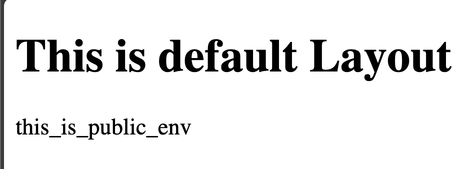
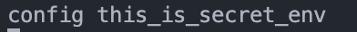

# Nuxt 3 CMS Stock Course EP.23 - useRuntimeConfig

## Outcome

-   Learn how to use `useRuntimeConfig` composable
-   Learn how to set `runtimeConfig` in `nuxt.config.ts`
-   Learn how to use `runtimeConfig` in `client` and `server`

## Documentation for this episode

https://nuxt.com/docs/api/composables/use-runtime-config

## Setup

1. Create `.env` file in root folder and add code below

```env
PUBLIC_ENV=this_is_public_env
SECRET_ENV=this_is_secret_env
```

2. Create `use-runtime-config.vue` folder inside `~/pages/demo/composables` folder and add code below

```vue
<template>
    <div>
        {{ config.public.publicEnv }}
    </div>
</template>

<script setup lang="ts">
const config = useRuntimeConfig();
await useFetch("/api/secret-env");
</script>

<style scoped></style>
```

3. Create `secret-env.ts` file inside `~/server/api` folder and add code below

```ts
export default defineEventHandler((event) => {
    const config = useRuntimeConfig(event);
    console.log("config", config.secretEnv);
    return {};
});
```

4. Create `nuxt.config.ts` file inside root folder and add code below

```ts
// https://nuxt.com/docs/api/configuration/nuxt-config
export default defineNuxtConfig({
    ...
    ...
    runtimeConfig: {
        secretEnv: process.env.SECRET_ENV,
        public: {
            publicEnv: process.env.PUBLIC_ENV,
        },
    },
});
```

5. Go visit `http://localhost:3000/demo/composables/use-runtime-config` and we should see following result

## Result

When we visit `http://localhost:3000/demo/composables/use-runtime-config` we should see following result

1. `this_is_public_env` should be shown in browser



2. `config this_is_secret_env` should be shown in terminal


